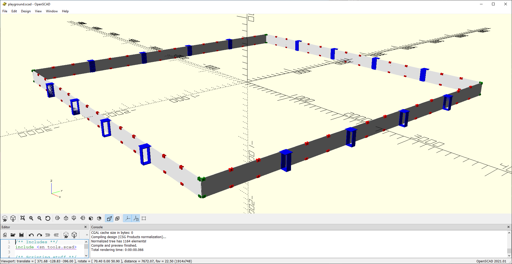

# Robot Playground

Made to create a playground structure with corflute panels.

Contains STL's and OpenSCAD Generator files to make clamping playgrounds for Robots.

The components serve as joins and clamps for 5mm corflute panels to make a lightweight and portable play area for the turtlebot. All of the STL files are designed to be printed in PLA and the vertical resolution means printing them in basically any layer height.

The parts are designed to squeese the 5mm corflute by 0.3mm - they are not powerful mechanically so they will fly apart if you 

## Parts to print

There are 4 main printable parts:

| part | name | desc |
|-|-|-|
| Corner | `stl/corner.stl` | this is a corner joiner ready to print, the flat surfaced one is for the bottom |
| Cross  | `stl/cross.stl` | this is a cross joiner stand ready to print, the flat surfaced one is for the bottom |
| Join | `stl/cross.stl` | this is a clamp part to join 2 straight corflute panels with friction stand ready, the flat surfaced one is for the bottom |
| Pedistol | `stl/clamp_pedistol_base.stl` `stl/clamp_pedistol.stl` | This is a two part stand, the base goes at the bottom.

## Printer settings

* Material - doesn't really matter but PLA is good
* Layer-height 0.1mm - 0.6mm - this isn't overly important as the parts have limited tolerances.
* Support is not needed apart from the pedistol components
* Wall thickness 1-1.5mm
* Infil 10% for gyroid infil, 15-25% for rectilinear 
* Too much infil/walls will make the models not stretch

## Example 

Building a 5m square 4x4 spaced pedistol with split corflute panels that are 333mm long so they can go into a travel case. This is the playground I designed this repo using. It has 16 pedistols with faces for AR images. The Turtlebot Waffle with Open Manipulator can drive around this and pick things up.

### BOM

| part | qty |
|-|-|
| Pedistol | 16 |
| Corner | 4 (pairs) |
| Join | 50 (pairs) |
| Corflute panels (188mm x 333mm x 5mm) |  60 |

### Assembly

Assuming you've printed all the parts and cut all the corflute. If you want to be extra stylish you can dovetail the corflute ends to have a stronger join - this will change the dimensions of the corflute

1. Connect 3 panels of corflute with 2 pairs of joiners
2. Lay out corners and pedistols evenly around the floor
3. Make walls out of 5 sets of panels with pedistols to connect them
4. Stand up walls with 

Preview


["The model is here"](https://github.com/mrkoz/robot-playground/blob/main/stl/playground-4x4.stl)

## Usage (Developers)

1. Clone down the tools repo [from here](https://github.com/mrkoz/openscad-parts)
2. Add the repo to the OpenSCAD path [instructions here](https://en.wikibooks.org/wiki/OpenSCAD_User_Manual/Libraries#Setting_OPENSCADPATH)
3. Hack away at the playground code, triggers are done in the `render_workspace` module.

## License

I like beer, so buy me a beer if you want and I'm not responsible for how you use this code.

```
/* 
 * — — — — — — — — — — — — — — — — — — — — — — — — — — — — — — — — — 
 * “THE BEER-WARE LICENSE” (Revision 42):
 * <Spidey> wrote this file. As long as you retain this  
 * notice you can do whatever you want with this stuff. If we meet
 * some day, and you think this stuff is worth it, you can buy me
 * a beer in return.
 * — — — — — — — — — — — — — — — — — — — — — — — — — — — — — — — — — 
 * Amendment 1: The author(s) of this code accept absolutely no 
 * liability for any damage or general bad things that may come as 
 * part of its use. Any use of this software is deemed an agreement 
 * to absolve the author(s) of any liability, culpability, 
 * durability and any other “(*)ability” (good or bad).
 */
 ```